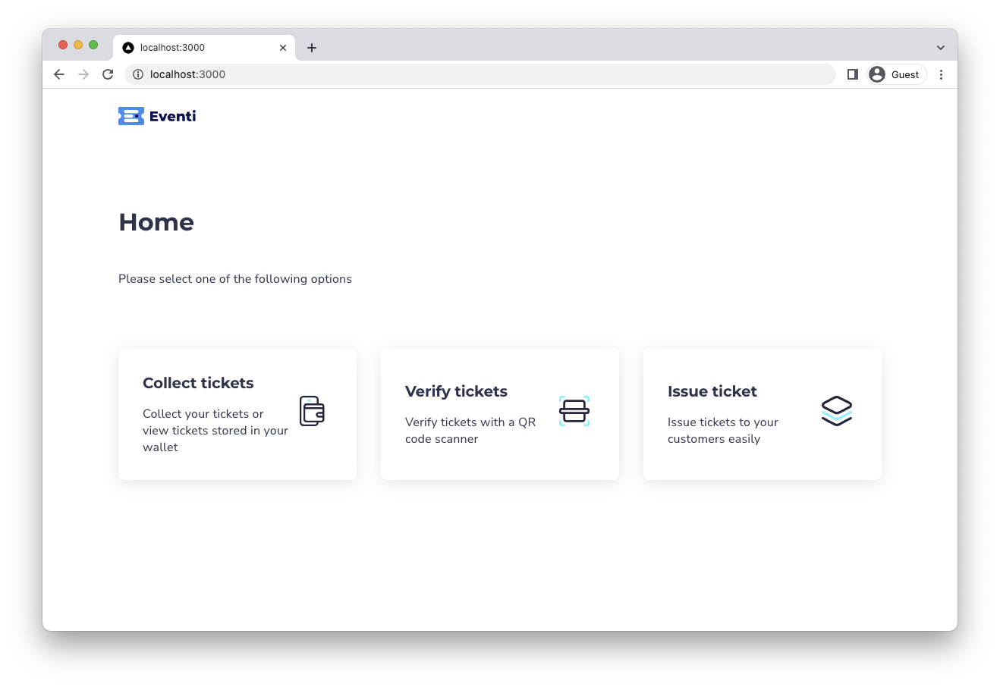
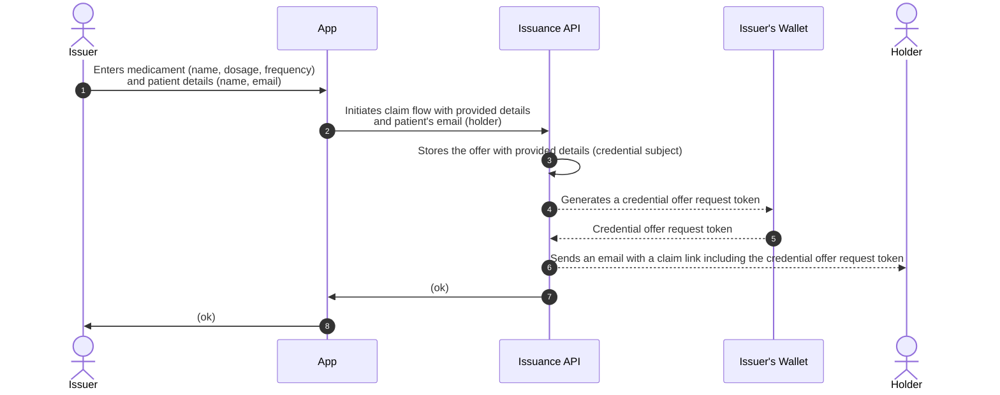
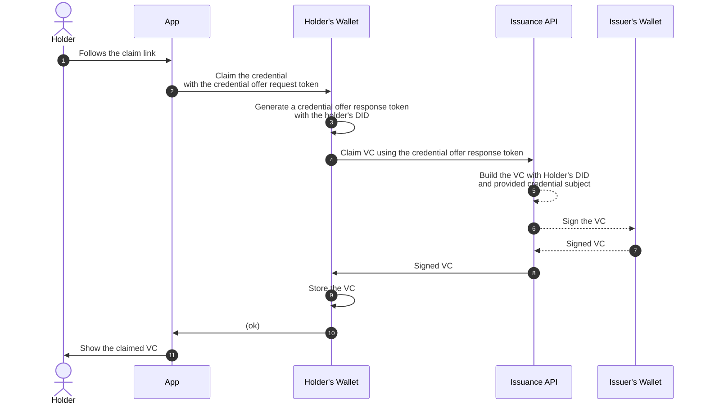
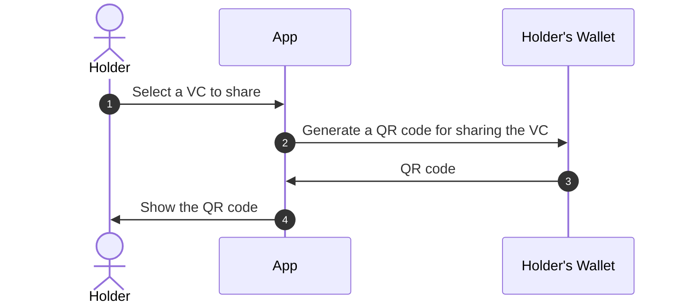
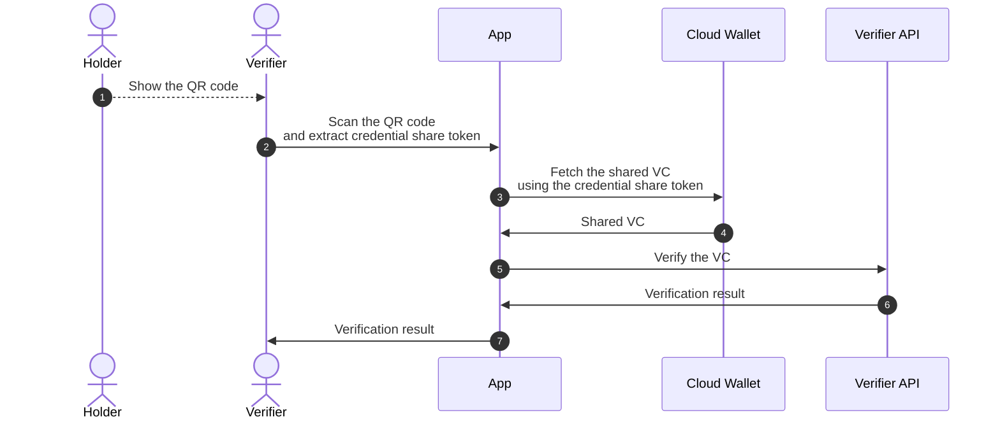

# Certification & Verification – an Affinidi reference app

This is a ready-to-use reference app that showcases usage of Affinidi API for issuing, sharing, verifying and storing verifiable credentials in the wallet.

## Introduction



Certification & Verification app allows you to issue, verify and store VCs in your wallet.  
You can take a role of an issuer, verifier or holder entity.

With SSI it's possible to create flows without ever storing user's data, while still being able to verify it.  
Users are responsible for their data and can store it in any way they want.

The app has multiple implementations which are designed for industry-specific use cases, making it an end-to-end example of a real app that you can deploy and use right away.

## Getting started

Setting up the reference app is easy, just follow these steps:  
1. Clone the repo:
    ```
    $ git clone git@github.com:affinidi/reference-app-health.git
    $ cd reference-app-health
    ```
2. Install the dependencies:
    ```
    $ npm install
    ```
3. Create a `.env` file:f
    ```
    $ cp .env.example .env
    ```

    **Enter values for `NEXT_PUBLIC_PROJECT_ID`, `NEXT_PUBLIC_PROJECT_DID` and `NEXT_PUBLIC_API_KEY_HASH` from your Affinidi project properties.**  
4. Launch the app:
    ```
    $ npm run dev
    ```
    
    App will be available locally on http://localhost:3000.

## App flavors

We have created multiple implementations of the same app for you to use.  
These are called "flavors" and they're adapted for a specific industry.

### "Ticketing" flavor

> Issue, verify and store tickets for events, such as concerts, conferences, meetups, etc.

As an issuer, you can enter details of the event and generate a ticket for a participant.  
Participant (holder) can then store that ticket in their wallet and share it as a QR code with the verifier when asked to.  
When the event starts, someone from the security (verifier) can quickly verify the QR.

### "Health" flavor

> Issue, verify and store prescriptions for medicaments.

As an issuer, you can enter details of the medications (dosage, frequency, etc.) and generate a prescription for a patient.  
Patient (holder) can then store that prescription in their wallet and share it as a QR code with the verifier when asked to.  
Pharmacist from a drug store can then quickly verify the QR and provide requested medicine.

### "Education" flavor

> Issue, verify and store course certificates.

As an issuer, you can enter details of the course and generate a certificate for a student.  
Student (holder) can then store that certificate in their wallet and share it as a QR code with the verifier when asked to.  
Job interviewer can then quickly verify the QR and validate your knowledge of the course topic.

## Flows

There are three flows in the app: **issuer**, **verifier** and **holder**.

### Issuer flow

1. Authenticate into your Affinidi account,
2. Enter credential subject details and holder information,
3. Click "Issue".

Claim link will be sent to the holder's email address.  

### Holder flow

#### Claim a credential

1. Open the offer email in your inbox,
2. Click on the claim link,
3. Authenticate into your wallet,
4. Claim the credential and store it your wallet.

#### Share a credential

> Note: You need to claim at least one VC to perform this flow.

1. Authenticate into your wallet,
2. Select a VC that you want to share,
3. Show the QR code to the verifier.

Verifier can then read the QR code and determine whether your VC is valid or not.

### Verifier flow

1. Open the scanner page,
2. Hold the QR code in front of the camera to scan it,
3. Check the results of the verification.

## Terminology

**Verifiable Credential (VC)** – a tamper-evident credential that has authorship that can be cryptographically verified.  
_In this app, tickets, prescriptions and certificates are the subjects of the issued verifiable credentials._  
Read [W3C specification](https://www.w3.org/TR/vc-data-model/).

**Holder** – an entity that owns the verifiable credential. Usually, a holder is the subject of the credential that they hold.  
_A holder in the app is a person who stores issued VCs in their wallet._

**Issuer** – an entity that issues the verifiable credential to the holder.  
_Issuer in this app is the entity that owns the app itself and signs the credentials. For example: a university, a clinic or a ticket sales company._

**Verifier** – an entity that accepts verifiable credentials to verify their validity and authorship.  
_Verifier is an entity that accepts the VCs and verifies their authorship and validity._  

**Wallet (Cloud Wallet)** – a service that provides functionality to sign credentials (for issuers) and to store credentials in the wallet (for holders).   
_This app uses the Affinidi Cloud Wallet API for authentication, holder credential storage and credential issuance._

**Issuance API** – a service that provides functionality to offer VCs by sending a claim link to the holder's email address. Holder then opens the link and stores the issued VC in their wallet.  
_This app uses the Affinidi VC Issuance API for performing the Claim Flow._

Learn more about [VCs](https://academy.affinidi.com/what-are-verifiable-credentials-79f1846a7b9), [trust triangle](https://academy.affinidi.com/what-is-the-trust-triangle-9a9caf36b321) and [Decentralized Identifiers (DIDs)](https://academy.affinidi.com/demystifying-decentralized-identifiers-dids-2dc6fc3148fd).

## Overview diagrams

> We'll use "Health" flavor as an example.

### Issuer flow

#### Issue a credential



### Holder flow

#### Claim a credential



#### Share a credential



### Verifier flow

#### Verify the credential



## Tools & frameworks

This project is built with **NextJS** framework, which allows you to quickly build apps using **TypeScript** and **React**. NextJS has built-in router, server-side rendering and backend support.
Read [NextJS docs](https://nextjs.org/docs/getting-started), [React docs](https://reactjs.org/docs/getting-started.html).  

We also use **Styled Components** and **Tailwind CSS** to build the UI.  
Read [Styled Components docs](https://styled-components.com/docs), [Tailwind CSS docs](https://tailwindcss.com/docs/installation).  

To make API requests, **axios** library is used.  
Read [axios docs](https://axios-http.com/docs/intro).  

Backend requests are validated with **zod** and logged with **pino**.  
Read [Zod docs](https://www.npmjs.com/package/zod), [pino docs](https://www.npmjs.com/package/pino).  

## Telemetry

Affinidi collects usage data to improve our products and services. For information on what data we collect and how we use your data, please refer to our [Privacy Policy](https://build.affinidi.com/dev-tools/privacy-policy.pdf).

## Feedback, Support, and Community

[Click here](https://github.com/affinidi/reference-app-health/issues) to create a ticket and we will get on it right away. If you are facing technical or other issues, you can reach out to us on [Discord](https://discord.com/invite/jx2hGBk5xE).

## FAQ

### A note from Affinidi

Affinidi Developer Tools are currently in the open beta phase and we are refining our product every day. The Affinidi Developer Tools may be incomplete and may contain errors – they may be unstable and may cause a loss of functionality and data. Use of the Affinidi Developer Tools will be at your own risk. As our engineers seek to improve our platform, we would not have the resources to provide any maintenance or tech support at this time. Please bear with us as we continue to improve the platform.

### What can I develop?

You are only limited by your imagination! Affinidi Developer Tools is a toolbox with which you can build software apps for personal or commercial use.

### Is there anything I should not develop?

We only provide the tools - how you use them is largely up to you. We have no control over what you develop with our tools - but please use our tools responsibly!

We hope that you would not develop anything that contravenes any applicable laws or regulations. Your projects should also not infringe on Affinidi’s or any third party’s intellectual property (for instance, misusing other parties’ data, code, logos, etc).

### What responsibilities do I have to my end-users?

Please ensure that you have in place your own terms and conditions, privacy policies, and other safeguards to ensure that the projects you build are secure for your end users.

If you are processing personal data, please protect the privacy and other legal rights of your end-users and store their personal or sensitive information securely.

Some of our components would also require you to incorporate our end-user notices into your terms and conditions.

### Are Affinidi Developer Tools free for use?

Affinidi Developer Tools are free during the open beta phase, so come onboard and experiment with our tools and see what you can build! We may bill for certain components in the future, but we will inform you beforehand.

### Is there any limit or cap to my usage of the Affinidi Developer Tools?

We may from time to time impose limits on your use of the Affinidi Developer Tools, such as limiting the number of API requests that you may make in a given duration. This is to ensure the smooth operation of the Affinidi Developer Tools so that you and all our other users can have a pleasant experience as we continue to scale and improve the Affinidi Developer Tools.

### Do I need to provide you with anything?

From time to time, we may request certain information from you to ensure that you are complying with the [Terms of Use](https://build.affinidi.com/dev-tools/terms-of-use.pdf).

### Can I share my developer’s account with others?

When you create a developer’s account with us, we will issue you your private login credentials. Please do not share this with anyone else, as you would be responsible for activities that happen under your account. If you have friends who are interested, ask them to sign up – let's build together!

## _Disclaimer_

_Please note that this FAQ is provided for informational purposes only and is not to be considered a legal document. For the legal terms and conditions governing your use of the Affinidi Developer Tools, please refer to our [Terms of Use](https://build.affinidi.com/dev-tools/terms-of-use.pdf)._
